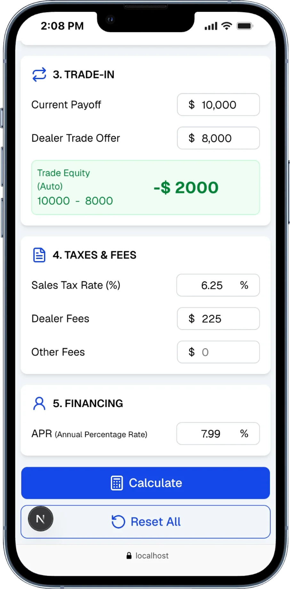
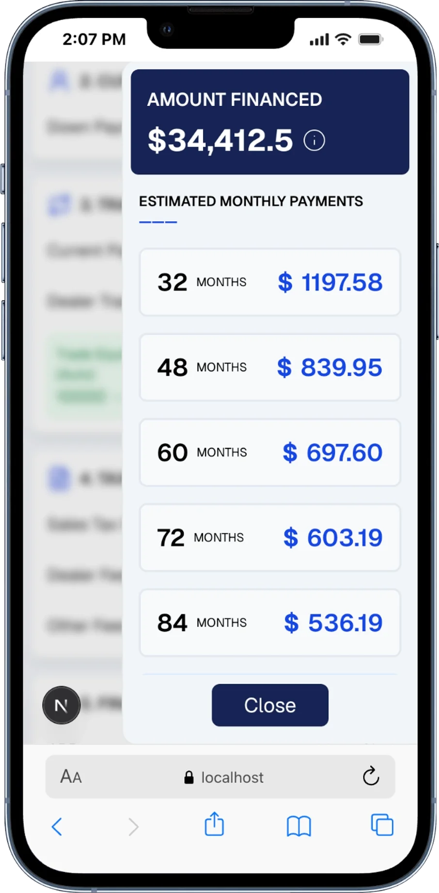

# Dealer Monthly Payment Calculator

Dealer Monthly Payment Calculator is a focused web application for estimating auto financing scenarios from a dealer-style workflow. It is designed for quick what-if calculations around trade-in equity, taxes, fees, and APR so a user can move from raw deal inputs to estimated monthly payments in a single flow.

The project exists as a practical frontend exercise in building a finance-oriented form with controlled inputs, derived values, and a clean mobile-friendly results experience. It is well suited for portfolio review because it combines product thinking, UI structure, and business calculation logic in one small application.

---

## Screenshot

 <p align="center">
  
  
</p>

---

## Features

- Captures the core inputs involved in a vehicle financing estimate, including vehicle price, down payment, trade-in payoff, dealer trade offer, taxes, fees, and APR.
- Calculates trade equity automatically from the difference between the current payoff and the dealer's trade offer.
- Estimates the total amount financed from the active deal inputs.
- Presents estimated monthly payments across several predefined loan terms.
- Uses a slide-out results panel to separate data entry from financing output.
- Supports fast scenario reset so multiple deal structures can be compared quickly.

---

## How It Works

From the user's perspective, the calculator follows the same sequence as a basic dealership payment worksheet. The user enters the vehicle price, customer cash contribution, trade-in details, fees, and APR. As the form is updated, the application derives intermediate values such as trade equity and the estimated amount financed.

When the user selects **Calculate**, the results panel opens and displays the financed amount along with estimated monthly payments for preset loan terms. This makes it easy to compare how payment size changes as the term length increases.

---

## Technologies Used

- Next.js
- React
- TypeScript
- Tailwind CSS
- shadcn/ui
- Vaul
- Lucide React
- next-themes
- Jest

---

## Learning Objectives

This project demonstrates several practical software engineering concepts:

- Financial calculation logic for trade equity, estimated financed amount, and amortized monthly payments.
- React state management with controlled form inputs and derived values.
- Component composition by separating the form workflow from the results view.
- TypeScript for typed state, component props, and calculation functions.
- Reusable UI primitives built with shadcn/ui and utility-based styling with Tailwind CSS.
- Mobile-friendly interaction patterns using a drawer-based results experience.

---

## Installation

```bash
git clone <repository-url>
cd dealer-monthly-payment-calculator
pnpm install
pnpm dev
```

The application will be available locally at `http://localhost:3000`.

---

## Project Structure

- `app/`  
  Application entrypoints, layout, global styles, and the main calculator page.

- `components/`  
  Shared React components, including the financing results panel.

- `components/ui/`  
  Reusable UI primitives based on shadcn/ui.

- `lib/`  
  Small shared utilities used across the application.

- `public/`  
  Static assets for the project.

---

## Future Improvements

- Add stronger input validation and clearer formatting rules for currency and percentage fields.
- Support a full amortization schedule instead of monthly payment summaries only.
- Add configurable loan terms rather than relying only on preset ranges.
- Persist scenarios so users can compare multiple financing structures.
- Introduce automated tests for the financial calculation helpers.
- Expand the tax and fee model to support more realistic state- or dealer-specific rules.

---

## License

This repository is provided for educational and portfolio purposes.

The source code may be studied and reviewed for learning, but commercial use, redistribution, or resale is not permitted without explicit permission from the author.
